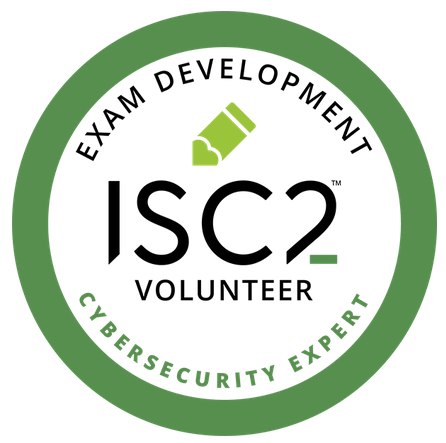
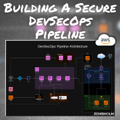

    
  

    
  

  

#  Welcome To My Profile

I'm eager to contribute to the success of innovative companies by leveraging my expertise in information security and software engineering. I thrive in a fast-paced, mission-focused environment that fosters innovation, growth, and problem-solving. I enjoy tackling new challenges and expanding my knowledge base.

🔥 Rapid Fire:

- 🔭 I’m currently working on.. shh it's private 🤫 (Uses: NEXT.JS, AWS, Figma)
- 🌱 I’m currently learning AI Security, API Security, Prompt Engineering and NEXT.JS
- 👯 I’m looking to collaborate on cool business projects that help shape communities.
- 🤔 I’m looking for help with financial empowerment for all people.
- 💬 Ask me about cybersecurity, app development, and real estate.
- 📫 How to reach me: smoke signals... or &nbsp; &nbsp;
- ⚡ Fun fact: ✈🪂

My interests encompass: 🤖 AI, 💹 FinTech, 🔐 Security, 🏡 Real Estate 

## 💻 Tech and Skills
> Non-exhaustive list

| Skill         | Tech         |
| ------------- | -------------------------------------------------------------------------------------------------------------------------------------------------------------------------------------------------------------------------------------------------------------------------------------------------------------------------- |
| Cloud         | &nbsp; &nbsp;  |
| Dev           | &nbsp; &nbsp; &nbsp; &nbsp; &nbsp; |
| Sec           | &nbsp; &nbsp; &nbsp; |
| Ops           | &nbsp; &nbsp; &nbsp; |

### Certs

  &nbsp;
  &nbsp;
  &nbsp;
  &nbsp;
  &nbsp;
  &nbsp;

## 🛠 Projects

  &nbsp;

## 📖 Starter Guides

  &nbsp;
  

## 🔥 My Stats
<!--  -->

## 👨🏾‍🍳 Other Projects

| Project Name                           | Description                                              | Technologies Used                |
|----------------------------------------|----------------------------------------------------------|----------------------------------|
| [Pantry Tracker](https://github.com/zchisholm/h02-pantry-tracker) | Quickly and easily track what is in your pantry.             | NEXT.js, Typescript             |

Credits:
- [@MishManners](https://github.com/mishmanners/MishManners) - For the cool profile tips
- [@anuraghazra](https://github.com/anuraghazra) -  For the GitHub Stats Chart
- [@Ileriayo](https://github.com/Ileriayo/) - For the badges
- [@devicons](https://github.com/devicons/) - For the icons
